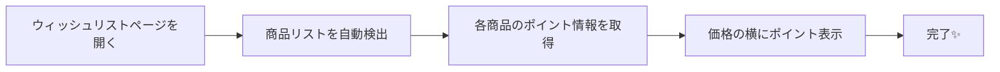

# 🎁 Devola: Amazon Wishlist Point Visualization

> **Amazonウィッシュリストがもっと便利に！**
> 「このアイテム、何ポイントもらえるんだろう？」を瞬時に解決 ✨

**Devola**は、Amazon.co.jpのウィッシュリストで**獲得予定ポイントを自動表示**するスマートなChrome拡張機能です。商品ページを個別に開く手間なく、ウィッシュリストを見ながら一目でポイント情報を確認できます。

<div align="center">

[](https://chrome.google.com/webstore/detail/devola-amazon-wishlist-po/khfjbdbepipkeecalhcpcnhkdfedkcki?hl=ja&authuser=0)

   

</div>

---

## ✨ なぜDevolaを使うのか？

### 🚀 こんな体験、ありませんか？
- ウィッシュリストを見ながら「このアイテム、何ポイントもらえるの？」と疑問に思う
- 商品ページを一つ一つ開いてポイントを確認するのが面倒
- ポイントも考慮してお得な買い物をしたい

**Devolaがあれば、すべて解決！**

### 🎯 主な機能

| 機能 | 説明 | メリット |
|------|------|----------|
| 🔍 **自動ポイント表示** | ウィッシュリストの各商品に獲得予定ポイントを自動表示 | 商品ページを開く手間が不要 |
| ⚡ **リアルタイム更新** | 動的に追加される商品にも瞬時にポイント情報を付与 | スムーズなブラウジング体験 |
| 📚 **全商品対応** | 通常商品からKindle本まで幅広く対応 | あらゆる商品でポイントを確認 |
| 🔒 **プライバシー重視** | 全ての処理はブラウザ内で完結、外部送信なし | 安心・安全な利用 |

### 🎯 対応範囲

**✅ 対応ページ**
- Amazon.co.jp ウィッシュリストページ

**❌ 非対応**
- Amazon.com（海外版Amazon）
- ランキングページ（既にAmazonが標準でポイント表示済み）

### 🔧 動作の流れ



1. **自動検出**: ページ上の商品リストを瞬時に認識
2. **情報取得**: 各商品の詳細ページからポイント情報を取得
3. **スマート表示**: 取得したポイントを価格の横に見やすく表示
4. **継続監視**: 新しく追加された商品も自動で処理

## 🚀 クイックスタート（開発者向け）

<details>
<summary>📋 開発環境の準備</summary>

### 必要な環境
- **Node.js** 18+
- **pnpm** (推奨) または npm
- **Git**

### ⚡ セットアップ手順

```bash
# 1. リポジトリをクローン
git clone git@github.com:big-mon/amazon-wishlist-pointgetter.git
cd amazon-wishlist-pointgetter

# 2. 依存関係をインストール
pnpm install

# 3. 開発ビルド実行
pnpm dev
```

### 🎛️ 利用可能なコマンド

| コマンド | 説明 | 用途 |
|----------|------|------|
| `pnpm dev` | 開発ビルド（ソースマップ付き） | 開発時 |
| `pnpm build` | 本番ビルド（最適化済み） | リリース時 |
| `pnpm watch` | ファイル監視モード | 開発時の自動ビルド |
| `pnpm type-check` | TypeScript型チェック | コード品質確認 |
| `pnpm clean` | ビルドファイル削除 | クリーンアップ |

### 🔧 Chrome拡張機能として読み込み

1. **Chrome拡張機能ページを開く**: `chrome://extensions/`
2. **デベロッパーモードを有効化**
3. **「パッケージ化されていない拡張機能を読み込む」** をクリック
4. **`/dist` フォルダを選択**

</details>

## 🛠️ 技術仕様

<details>
<summary>🔍 技術詳細を見る</summary>

### 🧰 技術スタック
- **言語**: TypeScript 5.7+
- **ビルドツール**: Webpack 5.99+
- **パッケージマネージャー**: pnpm
- **ターゲット**: ES2022
- **Chrome拡張**: Manifest V3

### 📁 プロジェクト構造
```
📦 amazon-wishlist-pointgetter
├── 📂 src/
│   ├── 📄 index.ts          # エントリーポイント
│   ├── 📄 wishlist.ts       # ウィッシュリスト処理ロジック
│   └── 📄 util.ts           # ポイント取得・解析ユーティリティ
├── 📂 public/
│   ├── 📄 manifest.json     # Chrome拡張マニフェスト
│   ├── 📂 _locales/         # 多言語対応ファイル
│   └── 📂 images/           # アイコン画像
├── 📂 dist/                 # ビルド成果物（自動生成）
└── 📄 webpack.config.js     # Webpack設定
```

### 🎯 技術的なポイント

**🔍 ポイント取得戦略**
複数のCSSセレクターでAmazonの様々な商品タイプに対応：
- **通常商品**: `#addToCart #pointsInsideBuyBox_feature_div span.a-color-price`
- **Kindle商品**: `.loyalty-points .a-align-bottom`, `.ebooks-aip-points-label .a-color-price`

**⚡ パフォーマンス最適化**
- `IntersectionObserver`による効率的な要素監視
- `MutationObserver`で動的コンテンツの自動検出
- WeakMapによるメモリ効率的な重複処理防止

</details>

## 🤝 コントリビューション

私たちと一緒にDevolaをより良くしませんか？

### 🌟 貢献方法
1. **Fork** このリポジトリ
2. **Feature branch** を作成 (`git checkout -b feature/amazing-feature`)
3. **Commit** 変更内容 (`git commit -m 'Add amazing feature'`)
4. **Push** ブランチ (`git push origin feature/amazing-feature`)
5. **Pull Request** を作成

### 🐛 バグ報告・機能提案
[Issues](https://github.com/big-mon/amazon-wishlist-pointgetter/issues) でお気軽にお知らせください！

## 📋 ライセンス

```
MIT License - 自由に使用・改変・配布可能
```

---

<div align="center">

**🎉 Devolaでより賢いAmazonショッピングを！**

</div>
